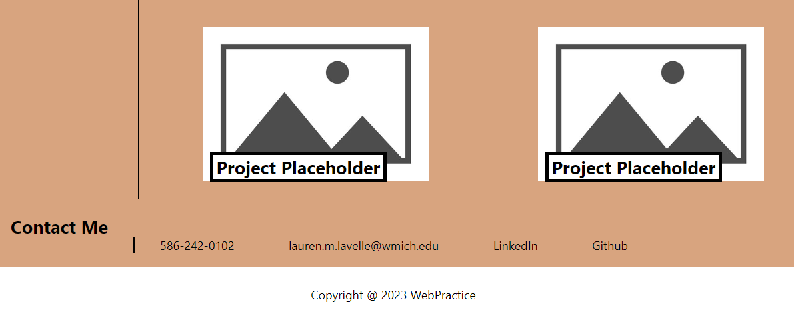

# Professional Portfolio

## Description

In this project a website was created with the developers portfolio of work samples for review by companies. This allows for review of the potential employees skills and knowledge of technical subjects and coding abilities.

Portfolio was developed with following criteria:

- In-page links to the website sections in the navigation bar
- Tilted images of projects
- External links embedded in picures of projects for reference to employee works
- Resposive layout for views on different electronic devices

## Installation

N/A

## Usage

On the website the header contains a nagivation bar with in-page links to the 3 sections on the website. These can be used by clicking on the text for the link.
All of the project images are linked to external sites where the projectd are hosted. In the contact me section the Github and LinkedIn text is linked to the corresponding sites.

 
 

## Credits

N/A

## [Website Link](https://l-lavelle.github.io/Professional-Portfolio/)
